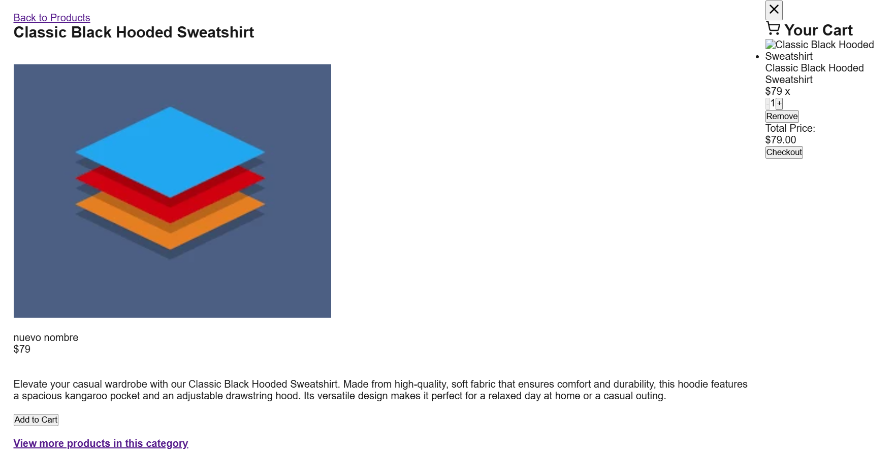
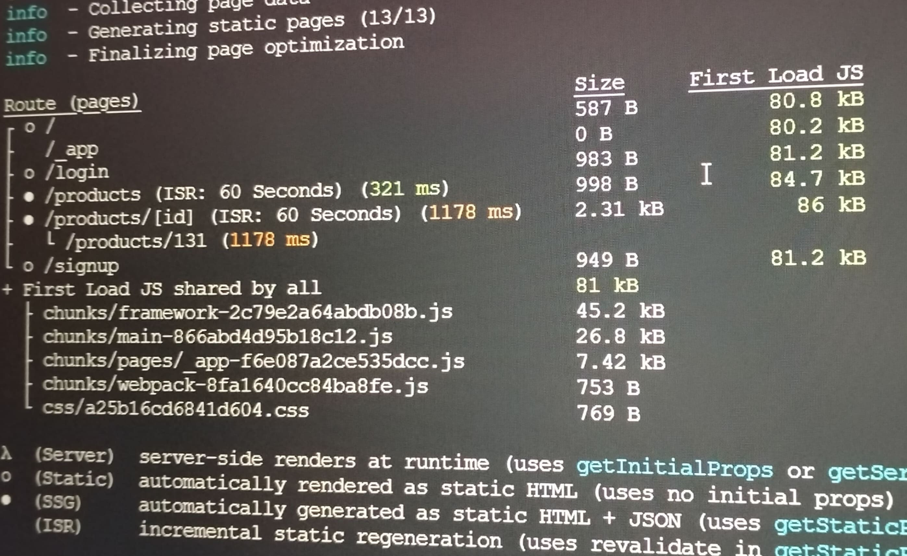

[VISIT SHOPSMART BY VITA](https://shopppvsmart.vercel.app)





## Table of Contents

- [Features](#features)
- [Tech Stack](#tech-stack)
- [Installation](#installation)
- [Project Structure](#project-structure)
- [Key Implementations](#key-implementations)
- [Build Details](#build-details)
- [Future Roadmap](#future-roadmap)


## Features

-**Product Listing**: Fetches and displays all products from the server
-**Product Details**: Displays detailed product information on individual product pages (/products/[id])
-**Categories-based Product Filtering**: Displays products based on categories (/categories/[id])
-**Cart Modal & Functionality**: Shows cart items, allows quantity updates, and displays total price before checkout. Users can add items to the cart with quantity selection
-**User Authentication**: Uses token-based authentication (stored in localStorage) for user login and checkout access
-**API Route Handler with Caching**: Caches product data to improve performance and reduce redundant API calls.
-**Error Handling**: Integrates error handling for API responses and faulty data.

## Tech Stack

- **Framework**: Next.js 13.4.0
- **Language**: TypeScript 5.0+
- **State Management**: React Context API
- **Styling**: Tailwind CSS
- **API**: RESTful integration
- **Deployment**: Vercel


## Installation

```bash
git clone https://github.com/revou-fsse-oct24/milestone-2-iteration-yvitamn.git
cd milestone-2-iteration-yvitamn
npm install
npm run dev
```

## Project Structure

```text
milestone-2-iteration-yvitamn/
src/
├── pages/
│   ├── products/         # Product Listing
│   ├── categories/       # Display based on categories
│   ├── checkout/         # Checkout pages
│   └── ...               # Other route segments
├── components/           # Reusable UI components
├── lib/                  # API clients and utilities
├── hooks/                # Custom React hooks
└── types/                # TypeScript type definitions
```


## Key Implementations

### Cart & State Management

**File**: `components/CartModal.tsx`
```typescript
const CartModal: React.FC<CartModalProps> = ({ isOpen, onClose }) => {
  const { isAuthenticated } = useAuth();  
  const { 
      addedProducts,
      removeProductFromCart, 
      setCheckout,
      handleQuantityChange

    } = useCart();
```

**File**: `components/CartSummary.tsx`
```typescript
export const CartSummary: React.FC<CartSummaryProps> = ({
  cartItems,
  removeProductFromCart,
  onCompleteCheckout,
  updateProductQuantity, 
}) => {
  const [totalPrice, setTotalPrice] = useState<number>(0);
```

### Cart Hook

**File**: `hooks/useCart.tsx`
```typescript
export const useCart = () => {
  const context = useContext(CartContext);

  if (!context) {
    throw new Error('useCart must be used within a CartProvider');
  }
  const {
    addedProducts,
    checkout,
    addProductToCart,
    removeProductFromCart,
    updateProductQuantity,
    onCompleteCheckout,
    setCheckout,
    clearCart
  } = context;
```

### API Route Handler with Caching

**File**: `products/api/product.ts`
```typescript
export default async function handler(_: NextApiRequest, res: NextApiResponse) {
  const cacheKey = 'all-products';

  // Check if data is cached
  const cachedData = cache.get(cacheKey);
  if (cachedData) {
    console.log('Serving from cache');
    return res.status(200).json(cachedData);
  }
```


## Build Details 
Build output with hybrid rendering:



## Future Roadmap
-[] UI Enhancements
-[] Shopping Experience
-[] Categories & Navigation
-[] Performance
-[] CI/CD 


